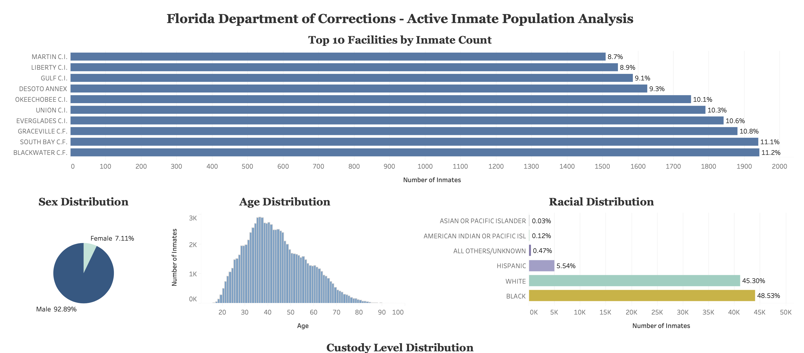
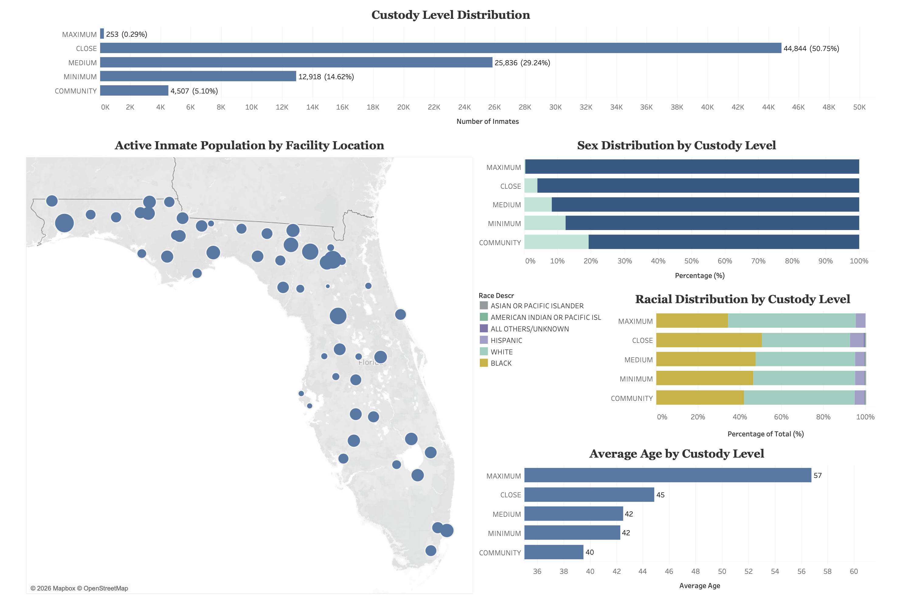
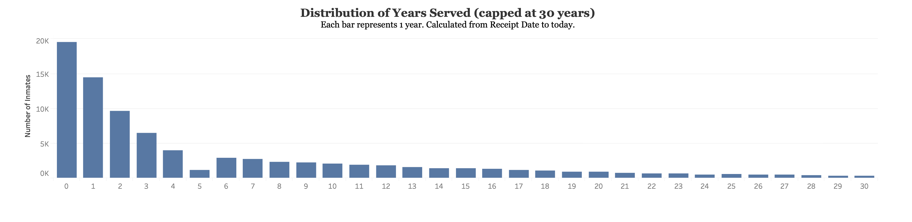

# Florida DOC Active Inmate Population Analysis Dashboard

## Overview
This project performs exploratory data analysis (EDA) on the Florida Department of
Corrections active inmate population dataset. The goal was to clean and explore the
data, uncover key demographic and operational patterns, and present findings in an
interactive Tableau dashboard.

This project was completed as part of a work sample for a Data Administration Analyst
position at the Florida Department of Corrections, Bureau of Research and Data Analysis.

## Screenshots




## Data Source
The data used in this project is sourced from the Florida Department of Corrections
public website. To download:

1. Go to [Florida DOC](https://www.dc.state.fl.us)
2. Click "Statistics" at the bottom of the page
3. Click "Complete OBIS Database Public Records Request"
4. Click "Inmate (Active)" to download the zip file
5. Extract and place contents in `data/raw/`

The primary file used is `INMATE_ACTIVE_ROOT.txt`, a tab-delimited text file containing
one record per active inmate with demographic, facility, and sentence information.

## Repository Structure
```
├── data/
│   ├── raw/               # Raw data files (not tracked by git)
│   └── processed/         # Cleaned data files (not tracked by git)
├── scripts/
│   ├── eda.ipynb          # EDA and data cleaning notebook
│   └── county_analysis.ipynb  # County of conviction analysis (separate task)
├── requirements.txt
└── README.md
```

## Setup
1. Clone the repository
2. Install dependencies:
```
   pip install -r requirements.txt
```
3. Download the data as described above and place in `data/raw/`
4. Run `eda.ipynb` to reproduce the EDA and data cleaning

## Dashboard
An interactive Tableau Public dashboard was built from the cleaned dataset and can be
viewed here:

🔗 [Florida DOC Active Inmate Population Dashboard](https://public.tableau.com/app/profile/zepyoor.khechadoorian/viz/dashboard_17742233698270/FloridaDepartmentofCorrections-ActiveInmatePopulationAnalysis?publish=yes)

The dashboard includes 11 visualizations:
- Top 10 facilities by inmate count
- Age distribution
- Sex distribution
- Racial distribution
- Custody level distribution
- Sex distribution by custody level
- Racial distribution by custody level
- Average age by custody level
- Active inmate population by facility location (bubble map)
- Distribution of years served


## Key Findings
- The active inmate population consists of **90,663 inmates** across **212 facilities**
- The population is predominantly **male (~93%)** and **middle-aged (median age 42)**
- **Black and White inmates** each comprise roughly equal shares (~49% and ~45%)
- The majority of inmates are classified at **CLOSE (~51%)** or **MEDIUM (~29%)** security
- **Female inmates** are more largely represented at lower security levels, consistent with national corrections trends
- Most inmates have served **fewer than 5 years**, with a long tail of long-term inmates
- Inmate populations are concentrated in **north and central Florida**